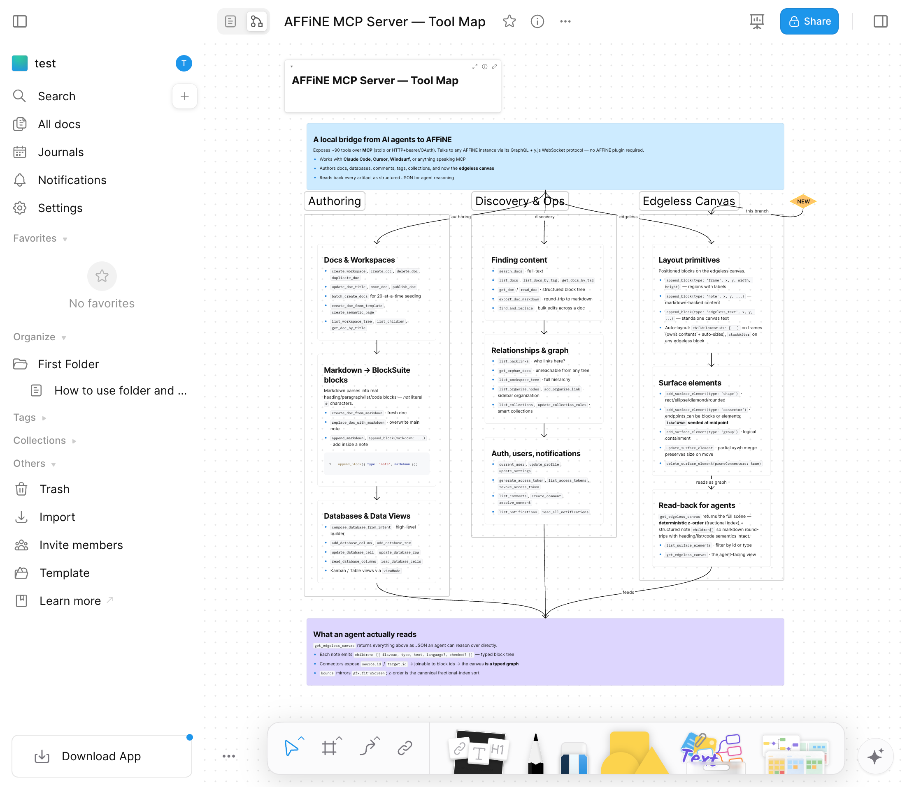

# Edgeless Canvas Cookbook

A worked, live-authored walkthrough of the edgeless canvas tools. Every call in this doc was executed against a running AFFiNE instance while authoring it; the IDs, coordinates, and responses below are real output from that session, not illustrative fiction.

## What you'll build

An auth-flow diagram: four rectangles (User, Auth Service, Database, Cache) stitched with labeled connectors, wrapped in a **Frame that owns the diagram** — drag the frame in the editor and everything inside moves with it. Followed by an epilogue note that lands in the right place by itself, no coordinate math.

```
┌─ Frame "Auth Flow" ────────────────────────────────────────┐
│                                                            │
│   [ User ]  ──authenticate─→  [ Auth Service ]             │
│                                    │                       │
│                              ──verify──→                   │
│                                    │                       │
│                              [ Database ]                  │
│                                                            │
│                              [ Cache ]  ←─session lookup─  │
└────────────────────────────────────────────────────────────┘

[ Epilogue note — auto-placed below the frame with padding gap ]
```

## The full call sequence

Every step below is copy-pasteable. Replace `W` with your workspace id.

### 1. Fresh doc

```js
const { docId: D } = await call("create_doc", {
  workspaceId: W,
  title: "Edgeless Canvas Cookbook — Live Demo",
  content: "This doc was seeded live by the edgeless-canvas cookbook.",
});
```

AFFiNE seeds a default note at `[0,0,800,~268]` — we'll leave it; step 6 demonstrates how the auto-placement default dodges it.

### 2. Three surface shapes

```js
const user = await call("add_surface_element", {
  workspaceId: W, docId: D, type: "shape", shapeType: "rect", radius: 0.2,
  x: 200, y: 400, width: 160, height: 80, text: "User", fontSize: 18,
  fillColor: "--affine-palette-shape-blue",
});
const auth = await call("add_surface_element", {
  workspaceId: W, docId: D, type: "shape", shapeType: "rect", radius: 0.2,
  x: 500, y: 400, width: 160, height: 80, text: "Auth Service", fontSize: 18,
  fillColor: "--affine-palette-shape-green",
});
const db = await call("add_surface_element", {
  workspaceId: W, docId: D, type: "shape", shapeType: "rect", radius: 0.2,
  x: 800, y: 400, width: 160, height: 80, text: "Database", fontSize: 18,
  fillColor: "--affine-palette-shape-purple",
});
// → returns { added: true, elementId: "cczYKQ593K", type: "shape", surfaceBlockId: "wpv4iPX3Qj" }, ...
```

### 3. Labeled connectors between them

```js
const c1 = await call("add_surface_element", {
  workspaceId: W, docId: D, type: "connector",
  sourceId: user.elementId, targetId: auth.elementId, label: "authenticate",
});
const c2 = await call("add_surface_element", {
  workspaceId: W, docId: D, type: "connector",
  sourceId: auth.elementId, targetId: db.elementId, label: "verify",
});
```

With both endpoints bound by id and no explicit `sourcePosition` / `targetPosition`, BlockSuite's side-midpoint auto-snap kicks in — each endpoint lands on one of `[0.5,0]`, `[0.5,1]`, `[0,0.5]`, `[1,0.5]`. `labelXYWH` is seeded at the source→target midpoint so the label renders on first open.

### 4. Wrap the diagram in a frame that **owns** it

```js
const frame = await call("append_block", {
  workspaceId: W, docId: D, type: "frame",
  text: "Auth Flow",
  childElementIds: [user.elementId, auth.elementId, db.elementId, c1.elementId, c2.elementId],
  padding: 50,
});
// → {
//     appended: true, blockId: "wx0OB2I2cp", flavour: "affine:frame",
//     ownedIds: ["cczYKQ593K","dSfmVkc3Io","goh9bQO5sg","jDvyiSy5Su","O5Gtcr17O2"],
//     missing: []
//   }
```

With `width`/`height` omitted, the frame auto-sizes to the union of its children's bounds plus `padding` on each side and a 30px title band at the top. Every resolved id lands in `ownedIds` — dragging the frame in the editor now drags the whole diagram. BlockSuite's `prop:childElementIds` accepts both surface elements (shapes/connectors/groups) and edgeless blocks (notes/frames/edgeless-text), so you can wrap either without triage.

### 5. Add a new member and let the frame regrow

```js
const cache = await call("add_surface_element", {
  workspaceId: W, docId: D, type: "shape", shapeType: "rect", radius: 0.2,
  x: 500, y: 600, width: 160, height: 80, text: "Cache", fontSize: 18,
  fillColor: "--affine-palette-shape-orange",
});
const c3 = await call("add_surface_element", {
  workspaceId: W, docId: D, type: "connector", mode: 1,
  sourceId: auth.elementId, targetId: cache.elementId, label: "session lookup",
});

await call("update_frame_children", {
  workspaceId: W, docId: D, blockId: frame.blockId,
  childElementIds: [user.elementId, auth.elementId, db.elementId, c1.elementId, c2.elementId, cache.elementId, c3.elementId],
  padding: 50,
});
// → {
//     updated: true, blockId: "wx0OB2I2cp", flavour: "affine:frame",
//     ownedIds: [..., "9aYW_HNajo", "wzoKIrLkO-"],
//     missing: [],
//     resized: true, xywh: { x: 150, y: 290, width: 860, height: 440 }
//   }
```

`update_frame_children` replaces ownership **wholesale** (same semantics as `update_surface_element` for a group's `children`) and by default recomputes `xywh` so the box fits its new contents. Pass `resizeToFit: false` to keep the box untouched:

```js
await call("update_frame_children", {
  workspaceId: W, docId: D, blockId: frame.blockId,
  childElementIds: [user.elementId, auth.elementId, db.elementId, c1.elementId, c2.elementId],
  resizeToFit: false,
});
// → { updated: true, ownedIds: [...], resized: false }
```

Use the opt-out when you want to shrink ownership without the frame jumping around the canvas.

### 6. Append a note with no coordinates — it lands in the right place

```js
await call("append_block", {
  workspaceId: W, docId: D, type: "note",
  width: 800, height: 120,
  markdown: [
    "## How this canvas was built",
    "",
    "Every block, shape, and frame above was authored with a single MCP tool call.",
    "The frame owns its shapes via `prop:childElementIds` — drag it and the diagram moves with it.",
  ].join("\n"),
});
// → note xywh ends up at [150, 770, 800, 166.5]
```

No `x`/`y`, no `stackAfter` — yet the note lands at `y=770`, which is the frame's bottom edge (`290 + 440 = 730`) plus the default `padding` gap of 40. When you append a `frame`/`note`/`edgeless_text` to a doc and don't provide an explicit position or `stackAfter`, the server auto-stacks it below whichever edgeless block sits lowest. The common "new note overlaps AFFiNE's seeded default note at `[0,0,…]`" papercut is gone.

Pass `x: 0, y: 0` explicitly if you *want* the old behavior back.

## The id triage: owned vs missing

`childElementIds` (on both `append_block` and `update_frame_children`) accepts any mix of surface-element and block ids. Everything that resolves gets written to the frame's `prop:childElementIds` Y.Map — the same shape BlockSuite's editor writes when you drag members into a frame, so dragging the frame drags every owned member regardless of flavour.

| Lands in | When |
| --- | --- |
| `ownedIds` | id resolves to an existing surface element OR edgeless block. Written to `prop:childElementIds`. Frame drags them along. |
| `missing` | id doesn't resolve to either. Skipped; returned so callers can tell stale ids from intentional ones. |

If **every** id is missing on `append_block`, the call throws (`None of the ids in childElementIds were found: [...]`) — that's almost always a caller bug. `update_frame_children` tolerates all-missing and treats it as "clear ownership" (paired with a skipped resize).

## Read the whole canvas back

```js
const canvas = await call("get_edgeless_canvas", { workspaceId: W, docId: D });
// canvas.edgelessBlocks: [
//   { flavour: "affine:note",  xywh: "[0,0,800,268]",     bounds: {...}, children: [...] },
//   { flavour: "affine:frame", xywh: "[150,290,860,440]", title: "Auth Flow",
//     childElementIds: ["cczYKQ593K","dSfmVkc3Io","goh9bQO5sg","jDvyiSy5Su","O5Gtcr17O2","9aYW_HNajo","wzoKIrLkO-"] },
//   { flavour: "affine:note",  xywh: "[150,770,800,166.5]", children: [
//       { flavour: "affine:paragraph", text: "How this canvas was built", type: "h2" },
//       { flavour: "affine:paragraph", text: "Every block, shape, and frame above...", type: "text" },
//   ] },
// ],
// canvas.surfaceElements: [shape(User), shape(Auth), shape(Database),
//                          connector(authenticate), connector(verify),
//                          shape(Cache), connector(session lookup)],
// canvas.bounds: { minX: 0, minY: 0, maxX: 1010, maxY: 936.5, width: 1010, height: 936.5 }
```

Frame entries now carry `childElementIds: string[]` so agents can see ownership without crawling the surface layer. Note entries emit a structured `children: [{ flavour, type, text, language?, checked? }]` array — markdown round-trips with heading/list/code semantics intact, no re-parsing needed.

## Running it

From the repo root with Docker available:

```bash
. tests/generate-test-env.sh
docker compose -f docker/docker-compose.yml up -d
node tests/acquire-credentials.mjs
npm run build
```

Then drop the calls above into a Node script that opens a `StdioClientTransport` against `dist/index.js` — `tests/test-canvas-tool-map-demo.mjs` is a complete example of the client wiring, minus the auth-flow content. The script prints the seeded doc URL; open it in a browser, switch to edgeless mode (icon next to the doc title), and the frame + its five owned elements select and drag as one.

## Advanced: the tool-map showcase

`tests/test-canvas-tool-map-demo.mjs` seeds a much larger canvas — three color-coded columns mapping the full tool catalog, with each column's notes owned by a frame via `childElementIds` so dragging the frame moves the entire column together. It doubles as a layout-helper regression test wired into `tests/run-e2e.sh`. It's the right place to look for end-to-end coverage of `stackAfter`, `childElementIds` ownership across flavours, connector side-midpoint auto-snap, and `labelXYWH` seeding all in one run.

<picture>
  <source media="(prefers-color-scheme: dark)" srcset="./assets/edgeless-canvas-demo-advanced-dark.png">
  
</picture>

## Tool surface at a glance

| Tool | Purpose |
| --- | --- |
| `add_surface_element` | Shapes / connectors / canvas text / groups on `affine:surface`. Connectors auto-snap endpoints to side-midpoints when both are bound by id. |
| `append_block(type="frame", childElementIds)` | Create a frame that owns surface elements and auto-sizes to contain them. |
| `update_frame_children` | Replace a frame's contents wholesale. Default resizes to fit; `resizeToFit: false` preserves the current box. |
| `append_block(type="note" / "frame" / "edgeless_text")` | Edgeless blocks. Bare calls auto-stack below existing blocks; pass `x`/`y` or `stackAfter` to override. |
| `get_edgeless_canvas` | Read the full canvas: edgeless blocks + surface elements with parsed bounds, aggregate bounding box, and per-type counts. Frame entries now include `childElementIds`. |

## BlockSuite alignment notes

Everything above writes to the native BlockSuite schema — no custom overlay:

- Surface elements land in `affine:surface` → `prop:elements.value` as `Y.Map` entries with fractional-index strings for stable z-order.
- Frame ownership uses `prop:childElementIds` as a `Y.Map<boolean>` keyed by element id — identical shape to a group's `children` map.
- Connectors with both endpoints bound by id and no explicit position auto-snap to the four tangent-carrying side-midpoints (`[0.5,0]`, `[0.5,1]`, `[0,0.5]`, `[1,0.5]`).
- `labelXYWH` is seeded at the source→target midpoint so BlockSuite's label renderer doesn't short-circuit on first render.
- `append_block(type="edgeless_text", text=…)` auto-creates a child `affine:paragraph` — the edgeless-text view walks `sys:children` for glyphs, so without it the block renders as an invisible sliver.
- `src/edgeless/layout.ts` is a dependency-free module citing the upstream BlockSuite files each helper mirrors (`connector.ts`, `connector-manager.ts`, `edgeless-note-mask.ts`), so future parity audits stay cheap.
